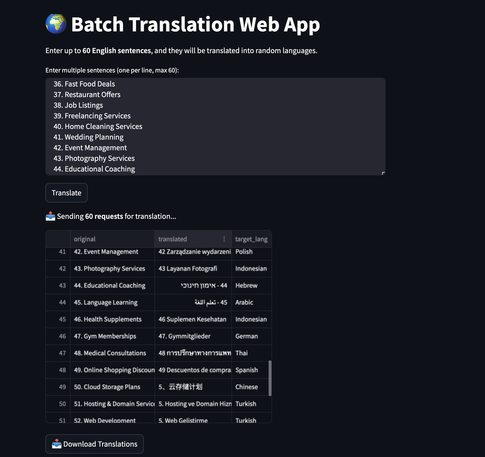

# 🌍 Project : Batch Translation Web App using M2M100 

This project provides an **async translation API** using `M2M100` from Hugging Face.This project is an asynchronous batch translation tool that translates English text into 100+ languages using Hugging Face's M2M100 model. The script, translate_async.py, leverages asyncio and aiohttp to handle 60 parallel translation requests, making it fast and efficient.


## 📌 Features
✅ Detects **source language**  
✅ Translates **to 100+ languages**  
✅ Uses **`asyncio` & `aiohttp`** for speed  
✅ Batch processing of **60 parallel requests**
✅ Uses Hugging Face’s M2M100 model for accurate translation

## Outlook of tool 


## 🔹 How It Works
1. User provides a list of up to 60 English phrases.
2. Each phrase is translated asynchronously using the M2M100 model.
3. Translations are returned in JSON format, with detected language, translated text, and target language.

## 🚀 Technologies Used
1. Hugging Face Transformers (M2M100, XLM-RoBERTa)
2. Python Libraries: asyncio, aiohttp, torch, sentencepiece
3. Streamlit Web App (Optional) for UI-based interaction
   

## 📌 Future Improvements

1. Deploy as an API using FastAPI
2. Allow user-selected target languages
3. Integrate text-to-speech for real-time voice translation

## 🚀 How to Run
###  Install Dependencies**
 ```bash
pip install -r requirements.txt
streamlit run app.py

